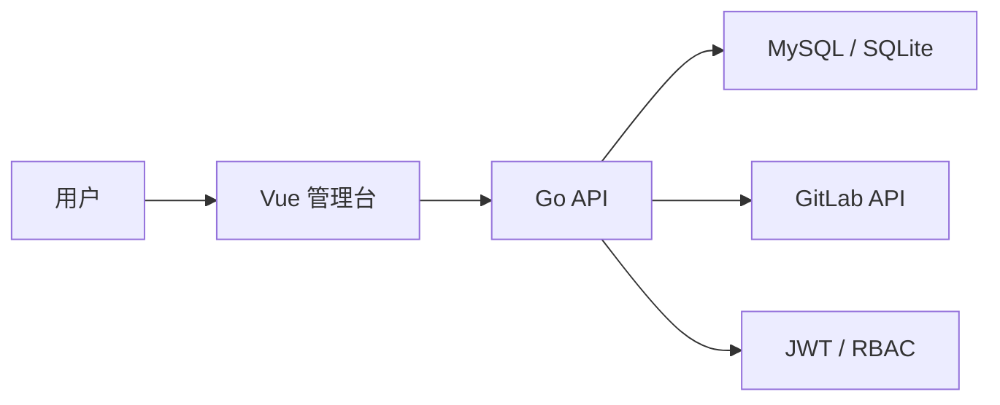
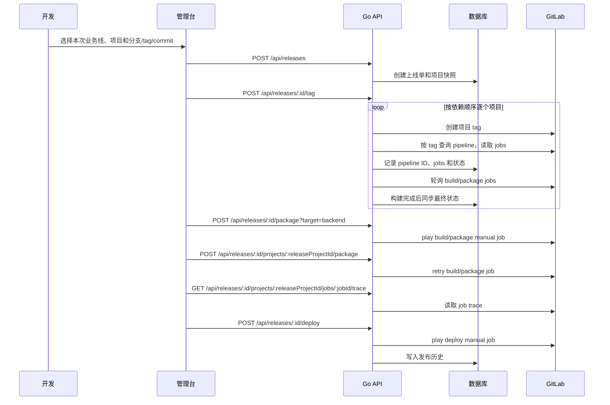

# 架构说明

## 模块边界

## 后端模块

- `internal/model`：用户、业务线、项目多业务线关联、依赖、上线单、上线项目、发布事件。
- `internal/api`：HTTP 路由、登录鉴权、配置管理、上线单和执行接口。
- `internal/release`：批次号生成、依赖排序、tag 生成、自动构建等待、同步 pipeline jobs、按目标分组构建、单项目重试、job trace 查询、状态聚合。
- `internal/gitlab`：创建 tag、按 tag 查询 pipeline、查询 pipeline jobs、触发 manual job、retry job、读取 job trace；dry-run 模式下返回模拟 pipeline/jobs。
- `internal/bootstrap`：初始化默认账号、业务线、项目和依赖顺序。

## 核心数据表

| 表 | 说明 |
| --- | --- |
| `users` | 用户、角色、登录信息 |
| `business_lines` | 业务线、平台、tag 前缀、tag 模板 |
| `projects` | 项目基础信息与 GitLab 配置 |
| `project_business_lines` | 项目与业务线多对多关系 |
| `project_dependencies` | 项目打包依赖 |
| `releases` | 上线单主表，保存本次发布业务线 |
| `release_projects` | 上线单内项目、本次业务线、来源、目标 tag、pipeline 状态 |
| `release_pipeline_jobs` | GitLab pipeline jobs 快照 |
| `release_events` | 发布历史时间线 |

## 发布流程

## 关键接口

| 方法 | 路径 | 说明 |
| --- | --- | --- |
| `POST` | `/api/auth/login` | 登录 |
| `GET` | `/api/projects` | 项目与依赖配置 |
| `PUT` | `/api/projects/order` | 保存项目打包顺序 |
| `PUT` | `/api/projects/:code` | 保存项目 GitLab 配置 |
| `GET` | `/api/business-lines` | 业务线 tag 配置 |
| `PUT` | `/api/dependencies/:code` | 保存项目依赖 |
| `POST` | `/api/releases` | 提交上线单 |
| `GET` | `/api/releases` | 发布历史 |
| `POST` | `/api/releases/:id/tag` | 统一打 tag |
| `POST` | `/api/releases/:id/package?target=all/backend/frontend` | 一键构建 |
| `POST` | `/api/releases/:id/deploy?target=all/backend/frontend` | 一键部署 |
| `POST` | `/api/releases/:id/projects/:releaseProjectId/package` | 单项目重新构建 |
| `POST` | `/api/releases/:id/projects/:releaseProjectId/deploy` | 单项目部署 |
| `GET` | `/api/releases/:id/projects/:releaseProjectId/jobs/:jobId/trace` | 查看 job 日志 |
